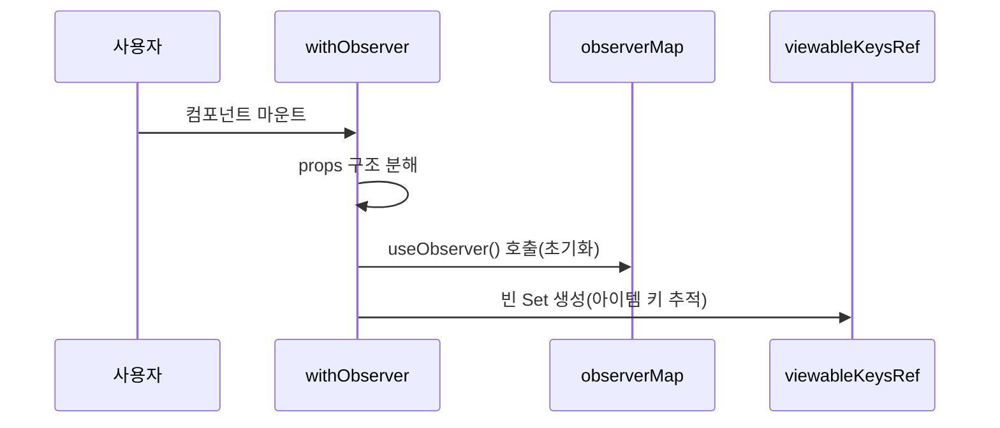
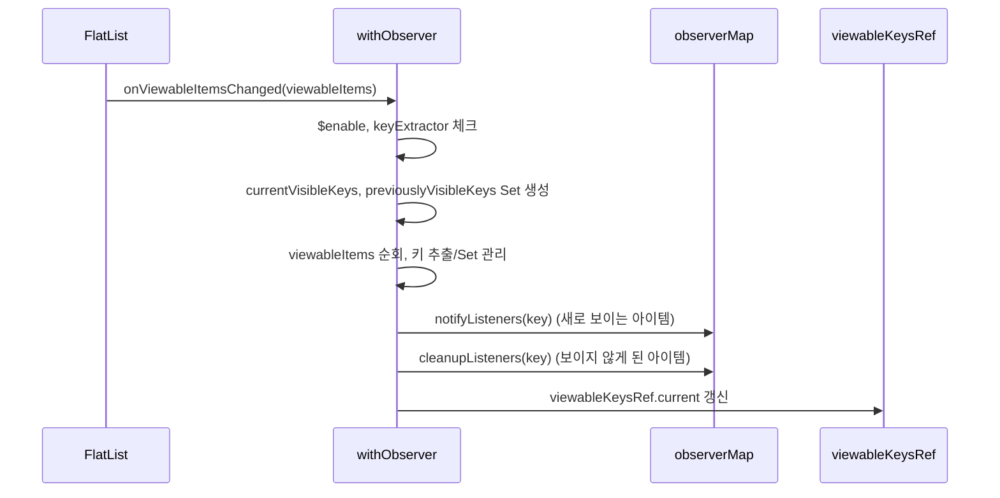
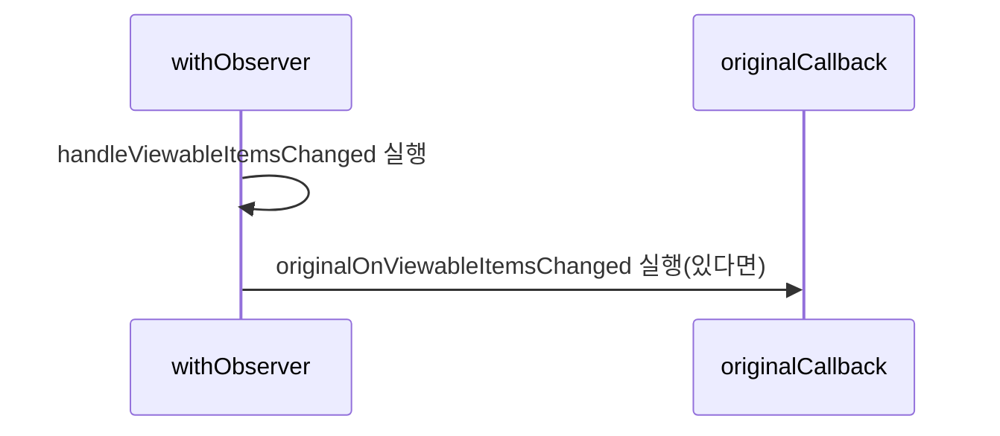
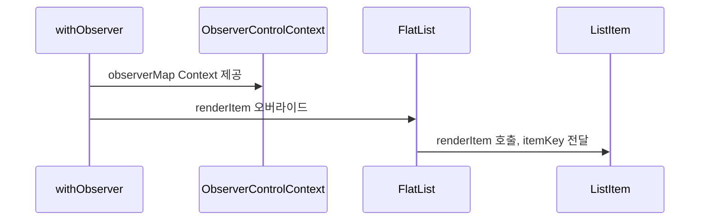
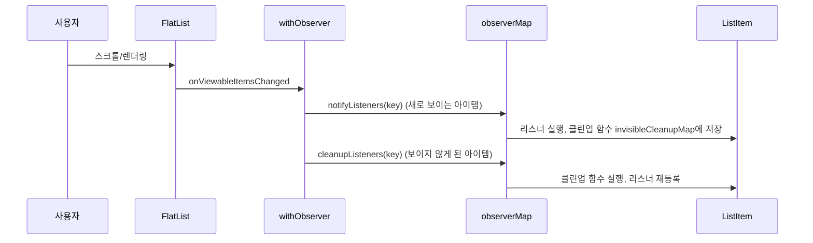

# React Native Observer 시스템 구조 및 사용법

## 개요

이 문서는 React Native 리스트 컴포넌트에 Observer 패턴을 적용하는 시스템의 구조와 사용법을 설명합니다.  
이 기능을 사용하면 리스트 아이템이 **화면에 보이거나 보이지 않을 때**를 감지하고, 각 아이템별로 리스너와 클린업 함수를 효과적으로 관리할 수 있습니다.


> 아이템이 화면에 보일 때마다 리스너가 실행되고, 사라질 때 클린업 함수가 호출됩니다.

---

## 주요 구성 요소

### 1. ObserverProvider

- `ItemContext`: 현재 렌더링 중인 아이템의 키를 저장합니다.
- `ObserverControlContext`: 아이템 뷰 상태를 관리하는 컨트롤러를 제공합니다.

```typescript
export const ItemContext = React.createContext<{ itemKey: string | null }>({
  itemKey: null,
});
export const ObserverControlContext = createContext<ObserverContextType | null>(
  null
);
```

---

### 2. withObserver HOC

일반 리스트 컴포넌트(예: `FlatList`)에 Observer 기능을 추가하는 고차 컴포넌트입니다.

#### 주요 기능

- 아이템이 **화면에 보이거나 보이지 않을 때**를 자동으로 감지합니다.
- 각 아이템의 고유 키로 리스너와 클린업 함수를 관리합니다.
- 아이템이 화면에 보이면 등록된 리스너를 실행하고, 화면에서 보이지 않게 되면 클린업 함수를 실행합니다.
- 기존 리스트 컴포넌트의 `onViewableItemsChanged`와 내부 처리 함수를 모두 실행합니다.

#### 옵션

- `$enable`: Observer 기능 활성화 여부(기본값: `true`)

#### 사용 예시

```tsx
const ObservedFlatList = withObserver(FlatList);

<ObservedFlatList
  data={items}
  renderItem={renderItem}
  keyExtractor={(item) => item.id}
  $enable={true}
/>;
```

---

### 3. useObserver 훅

Observer 시스템의 핵심 기능을 제공하는 커스텀 훅입니다.

#### 주요 기능

- `addListener(key, listener)`: 특정 키에 리스너 등록
- `removeListener(key, listener)`: 특정 키의 리스너 제거
- `notifyListeners(key)`: 특정 키의 모든 리스너 실행
- `cleanupListeners(key)`: 특정 키의 클린업 함수 실행

#### 사용 예시

```typescript
const observer = useObserver();

// 리스너 등록
observer.addListener("itemKey", () => {
  console.log("아이템이 화면에 보임");
  return () => console.log("아이템이 화면에 보이지 않음");
});
```

---

## 동작 원리 및 내부 구조

### 1. 리스너 및 클린업 함수 관리

```typescript
const visibleListenersMap = new Map(); // 아이템 키 별 리스너 저장
const invisibleCleanupMap = new Map(); // 아이템 키 별 클린업 함수 저장

// 리스너 등록
function addListener(key, listener) {
  if (!visibleListenersMap.has(key)) visibleListenersMap.set(key, new Set());
  visibleListenersMap.get(key).add(listener);
}

// 리스너 알림 (아이템이 화면에 보일 때)
function notifyListeners(key) {
  const listeners = visibleListenersMap.get(key) || [];
  listeners.forEach((listener) => {
    const cleanup = listener();
    if (typeof cleanup === "function") {
      if (!invisibleCleanupMap.has(key))
        invisibleCleanupMap.set(key, new Map());
      invisibleCleanupMap.get(key).set(listener, cleanup);
    }
  });
  visibleListenersMap.delete(key);
}

// 클린업 실행 (아이템이 화면에서 보이지 않을 때)
function cleanupListeners(key) {
  const cleanups = invisibleCleanupMap.get(key) || new Map();
  cleanups.forEach((cleanup, listener) => {
    cleanup();
    addListener(key, listener); // 리스너 다시 등록
  });
  invisibleCleanupMap.delete(key);
}
```

---

### 2. 아이템의 화면 보임/보이지 않음 감지

- `withObserver` HOC는 FlatList의 `onViewableItemsChanged` 콜백을 활용하여 아이템이 **화면에 보이거나 보이지 않을 때**를 감지합니다.

```typescript
// 화면에 보임/보이지 않음 변경 처리 함수
const handleViewableItemsChanged = ({ viewableItems }) => {
  const currentVisibleKeys = new Set(); // 현재 화면에 보이는 아이템들의 키
  const previouslyVisibleKeys = new Set(viewableKeysRef.current); // 이전에 화면에 보였던 아이템들의 키

  // 현재 화면에 보이는 아이템들 처리
  viewableItems.forEach(({ item, isViewable }) => {
    if (isViewable && item) {
      const key = keyExtractor(item);
      currentVisibleKeys.add(key);
      previouslyVisibleKeys.delete(key);
    }
  });

  // 새로 화면에 보이는 아이템들의 리스너에게 알림
  currentVisibleKeys.forEach((key) => {
    if (!viewableKeysRef.current.has(key)) {
      observerMap.notifyListeners(key);
    }
  });

  // 화면에서 보이지 않게 된 아이템들의 클린업 함수 실행
  previouslyVisibleKeys.forEach((key) => {
    observerMap.cleanupListeners(key);
  });

  // 현재 화면에 보이는 아이템들 저장
  viewableKeysRef.current = currentVisibleKeys;
};
```

---

### 3. Context 전달 구조

- `ObserverControlContext`와 `ItemContext`를 통해 하위 컴포넌트에서 Observer 기능과 아이템 키에 접근할 수 있습니다.

```typescript
return (
  <ObserverControlContext.Provider value={observerMap}>
    <Component
      ref={ref}
      {...componentProps}
      renderItem={(info) => {
        const itemKey = keyExtractor(info.item, info.index);
        return (
          <ItemContext.Provider value={{ itemKey }}>
            {renderItem(info)}
          </ItemContext.Provider>
        );
      }}
    />
  </ObserverControlContext.Provider>
);
```

---

# withObserver HOC의 동작 원리 및 이벤트 흐름

`withObserver` HOC는 React Native의 `FlatList가` 제공하는 `onViewableItemsChanged` 콜백을 활용하여  
아이템이 **화면에 보이거나 보이지 않을 때**를 감지합니다.

---

### 상세 동작 과정

#### 1. 초기화 단계

```typescript
export const withObserver = <
  Props extends BaseListProps<unknown>,
  ItemType = unknown,
  RefType = unknown
>(
  Component: ComponentType<Props>
) => {
  return forwardRef<RefType, WithObserverProps<Props, ItemType, RefType>>(
    (props, ref) => {
      // 1. props 구조 분해
      const {
        onViewableItemsChanged: originalOnViewableItemsChanged,
        keyExtractor,
        renderItem,
        data,
        $enable = true,
        ...restProps
      } = props;

      // 2. Observer 시스템 초기화 (useObserver 훅 호출)
      const observerMap =
        useObserver<ReturnType<NonNullable<typeof keyExtractor>>>();

      // 3. 현재 화면에 보이는 아이템 키를 추적하는 ref 생성
      const viewableKeysRef = useRef<
        Set<ReturnType<NonNullable<typeof keyExtractor>>>
      >(new Set());

      // ... 나머지 코드
    }
  );
};
```

- **props:**
  - `onViewableItemsChanged`: 원본 콜백(있다면 보존)
  - `keyExtractor`: 각 아이템의 고유 키 추출 함수
  - `renderItem`: 아이템 렌더링 함수
  - `$enable`: Observer 기능 활성화 여부(기본값: `true`)
- **Observer 시스템 초기화:**
  - `useObserver` 훅으로 리스너/클린업 관리 시스템 생성
- **viewableKeysRef 생성:**
  - 현재 화면에 보이는 아이템의 키를 Set으로 관리



---

#### 2. 화면 보임/보이지 않음 변경 감지 핸들러 정의

```typescript
const handleViewableItemsChanged = useCallback(
  ({ viewableItems }: { viewableItems: ViewToken[] }) => {
    // 1. Observer 기능이 비활성화되었거나 keyExtractor가 없으면 종료
    if (!$enable || !keyExtractor) return;

    // 2. 상태 추적용 Set 생성
    const currentVisibleKeys = new Set<ReturnType<typeof keyExtractor>>();
    const previouslyVisibleKeys = new Set(viewableKeysRef.current);

    // 3. 현재 화면에 보이는 아이템 처리
    viewableItems.forEach(({ index, item, isViewable }) => {
      if (isViewable && item != null) {
        const key = keyExtractor(item as ItemType, index ?? -1);
        currentVisibleKeys.add(key);
        previouslyVisibleKeys.delete(key);
      }
    });

    // 4. 새로 화면에 보이게 된 아이템 처리
    currentVisibleKeys.forEach((key) => {
      if (!viewableKeysRef.current.has(key)) {
        observerMap.notifyListeners(key);
      }
    });

    // 5. 화면에서 보이지 않게 된 아이템 처리
    previouslyVisibleKeys.forEach((key) => {
      observerMap.cleanupListeners(key);
    });

    // 6. 현재 상태 업데이트
    viewableKeysRef.current = currentVisibleKeys;
  },
  [$enable, keyExtractor, observerMap]
);
```

- **기능 활성화 체크:**
  - `$enable`이 `false`이거나 `keyExtractor`가 없으면 종료
- **상태 추적 Set 생성:**
  - `currentVisibleKeys`: 현재 화면에 보이는 아이템 키
  - `previouslyVisibleKeys`: 이전에 화면에 보였던 아이템 키
- **viewableItems 처리:**
  - 화면에 보이는 아이템만 처리, 키 추출 및 Set에 추가
- **새로 보이게 된 아이템:**
  - 이전에 없던 키에 대해 `notifyListeners(key)` 호출
- **보이지 않게 된 아이템:**
  - 이전에만 있던 키에 대해 `cleanupListeners(key)` 호출
- **상태 업데이트:**
  - `viewableKeysRef.current`를 최신 상태로 갱신



---

#### 3. 원본 콜백과 통합

```typescript
const combinedOnViewableItemsChanged = invokeSequentially(
  handleViewableItemsChanged,
  originalOnViewableItemsChanged
);
```

- 원본 컴포넌트의 `onViewableItemsChanged` 콜백이 있다면, 내부 핸들러와 함께 순차적으로 실행



---

#### 4. 최종 렌더링 구성

```typescript
return (
  <ObserverControlContext.Provider value={observerMap}>
    <Component
      ref={ref}
      {...componentProps}
      renderItem={(info) => {
        if (!keyExtractor || !renderItem) {
          console.error(
            "[withObserver] keyExtractor 또는 renderItem이 정의되지 않았습니다."
          );
          return null;
        }

        const typedInfo = info as ListRenderItemInfo<ItemType>;
        const itemKey = keyExtractor(typedInfo.item, typedInfo.index);

        return (
          <ItemContext.Provider value={{ itemKey }}>
            {renderItem(typedInfo)}
          </ItemContext.Provider>
        );
      }}
    />
  </ObserverControlContext.Provider>
);
```

- **ObserverControlContext 제공:**
  - `observerMap`을 Context로 하위 컴포넌트에 제공
- **원본 컴포넌트 렌더링:**
  - 수정된 props와 함께 렌더링
- **renderItem 오버라이드:**
  - 각 아이템의 고유 키 추출, `ItemContext.Provider`로 전달



---

### useObserver 훅에서의 이벤트 등록 및 해제 과정

#### 1. 리스너 등록 과정 (addListener)

```typescript
const addListener = (key: K, listener: L) => {
  registerListenerForKey(visibleListenersMap.current, key, listener);
  unregisterCleanupForKey(invisibleCleanupMap.current, key, listener);
};
```

- `visibleListenersMap`에 리스너 등록
- 이미 등록된 클린업 함수가 있다면 제거

#### 2. 리스너 알림 과정 (notifyListeners)

```typescript
const notifyListeners = (key: K, ...args: Parameters<L>) => {
  const listeners = visibleListenersMap.current.get(key);
  if (listeners && listeners.size > 0) {
    const listenersToNotify = new Set(listeners);
    visibleListenersMap.current.delete(key);

    listenersToNotify.forEach((listener) => {
      try {
        const cleanup = listener.apply(null, args);

        if (typeof cleanup === "function") {
          registerCleanupForKey(
            invisibleCleanupMap.current,
            key,
            listener,
            cleanup
          );
        }
      } catch (error) {
        console.error(
          `[ObserverMap] Error notifying listener for key "${String(key)}":`,
          error
        );
      }
    });
  }
};
```

- 특정 키에 등록된 모든 리스너 실행
- 리스너가 반환한 클린업 함수는 `invisibleCleanupMap`에 등록

#### 3. 클린업 실행 과정 (cleanupListeners)

```typescript
const cleanupListeners = (key: K) => {
  const cleanups = invisibleCleanupMap.current.get(key);
  if (cleanups && cleanups.size > 0) {
    const cleanupsToRun = new Map(cleanups);
    invisibleCleanupMap.current.delete(key);

    cleanupsToRun.forEach((cleanup, listener) => {
      try {
        if (typeof cleanup === "function") {
          cleanup();
        }
      } catch (error) {
        console.error(
          `[ObserverMap] Error cleaning up listener for key "${String(key)}":`,
          error
        );
      } finally {
        registerListenerForKey(visibleListenersMap.current, key, listener);
      }
    });
  }
};
```

- 특정 키에 등록된 모든 클린업 함수 실행
- 실행 후 리스너를 다시 등록

#### 4. 리스너 제거 과정 (removeListener)

```typescript
const removeListener = (key: K, listener: L) => {
  unregisterListenerForKey(visibleListenersMap.current, key, listener);
  unregisterCleanupForKey(invisibleCleanupMap.current, key, listener);
};
```

- `visibleListenersMap`과 `invisibleCleanupMap`에서 리스너/클린업 함수 제거

---

### 전체 이벤트 사이클 예시


